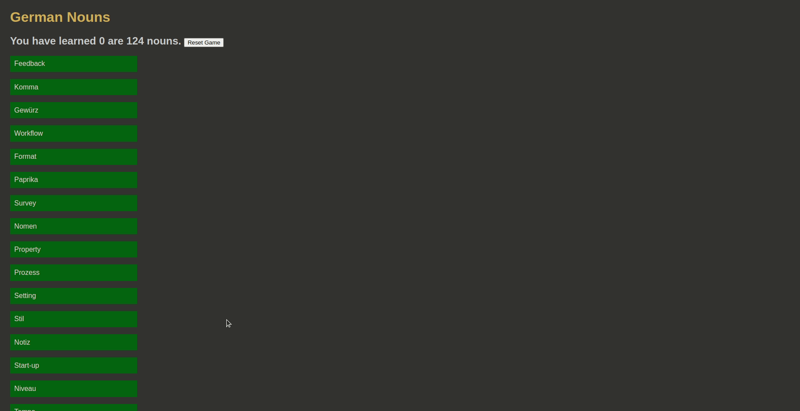

## German noun Game

**Little Game to learn arcticels of German nouns.**

**Build with**

<div>


</div>

---

**Features**

- nouns are loaded in random order
- users progress (nouns learned) is saved in local storage
- user can reset the game anytime to double check learned nouns

:popcorn: Enjoy the [Live Demo](german-nouns-game.vercel.app)




## Setup

 ```
   clone repository
   ```
 ```
   cd <your-repository-name>
   npm install
   ```
 ```
   npm run dev
   ```
 ```
   Enjoy 
   ```
